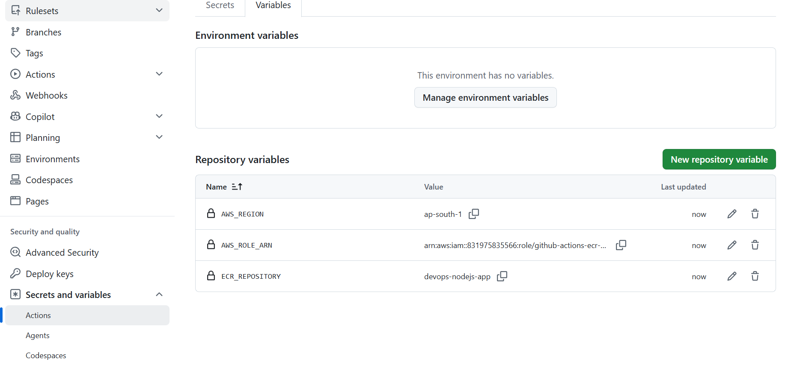

# Week 4 — AWS Foundation + ECR (`ap-south-1` Mumbai)

**Do these in order. Guardrails before resources.**

Region for everything in this project: **`ap-south-1` (Mumbai)**
Exception: billing alarms must be created in `us-east-1` (see step 1d).

---

## 1. Guardrails (do this FIRST — before creating anything)

Single source of truth for all guardrail and cost details:
[`COST_CONTROL.md`](./COST_CONTROL.md)

Complete these there first, then come back here:

- [ ] Account plan + credits recorded
- [ ] Calendar reminder set for **expiry − 2 weeks**
- [ ] Zero-spend budget created
- [ ] $5 budget (50/80/100 alerts) created
- [ ] Cost Explorer enabled
- [ ] Tagging strategy confirmed (`project=devops-learning`, `env=dev`) 

> Note: Cost Explorer activation is immediate, but billing data can take up to
> 24 hours to appear.

After those are checked in `COST_CONTROL.md`, continue to Step 2 below.

---

## 2. IAM: GitHub OIDC (no access keys)

We give GitHub Actions a **role it assumes on demand** instead of storing
permanent AWS keys in GitHub secrets. Leaked keys are the #1 cause of
compromised AWS accounts — this design has no key to leak.

### 2.0 Values to collect first (before clicking)

Keep these ready in a temporary note:

- `AWS_ACCOUNT_ID` (12-digit account id)
- `OWNER` (GitHub user/org, e.g. `sunnykumar-bhakta`)
- `REPO` (repo name, e.g. `devops`)

For this repo, use:

- `AWS_ACCOUNT_ID`: `831975835566`
- `OWNER`: `sunny-bhakta`
- `REPO`: `devops`

How to get them quickly:

- `AWS_ACCOUNT_ID`: top-right account menu in AWS console
- `OWNER/REPO`: from repo URL `https://github.com/<OWNER>/<REPO>`

### 2a. Create the identity provider

- IAM → **Identity providers** → **Add provider**
- Type: **OpenID Connect**
- Provider URL: `https://token.actions.githubusercontent.com`
- Audience: `sts.amazonaws.com`
- **Add provider**

### 2b. Create the role

- IAM → **Roles** → **Create role**
- Trusted entity: **Web identity**
- Identity provider: `token.actions.githubusercontent.com`
- Audience: `sts.amazonaws.com`
- **Next** → skip permissions for now → Name: `github-actions-ecr-push`
- **Create role**

If the AWS UI asks for **GitHub organization**:

- Use `OWNER` from Step 2.0
- Personal repo: enter your GitHub username (example: `sunnykumar-bhakta`)
- Organization repo: enter the org name exactly as in the repo URL

### 2c. Fix the trust policy

Open the role → **Trust policy** tab (or **Trust relationships** in older UI)
→ **Edit trust policy** → paste,
replacing `<AWS_ACCOUNT_ID>`, `<OWNER>`, `<REPO>`:

```json
{
  "Version": "2012-10-17",
  "Statement": [
    {
      "Effect": "Allow",
      "Principal": {
        "Federated": "arn:aws:iam::831975835566:oidc-provider/token.actions.githubusercontent.com"
      },
      "Action": [
        "sts:AssumeRoleWithWebIdentity",
        "sts:TagSession"
      ],
      "Condition": {
        "StringEquals": {
          "token.actions.githubusercontent.com:aud": "sts.amazonaws.com",
          "token.actions.githubusercontent.com:sub": "repo:sunny-bhakta/devops:ref:refs/heads/main"
        }
      }
    }
  ]
}
```

> The `sub` condition is the security boundary — only *your* repo can assume
> this role. Never use `"sub": "*"`.

Example `sub` value:

- `repo:sunny-bhakta/devops:ref:refs/heads/main`

Why this is stricter: it allows role assumption only from `main` branch runs,
not from every branch in the repository.

Why `sts:TagSession` is included: GitHub's AWS credentials action can attach
session tags. Without `sts:TagSession`, role assumption may fail with
`Not authorized to perform sts:AssumeRoleWithWebIdentity`.

### 2d. Attach a least-privilege policy

Role → **Add permissions** → **Create inline policy** → JSON →
name it `ecr-push`, replacing `<AWS_ACCOUNT_ID>`:

```json
{
  "Version": "2012-10-17",
  "Statement": [
    {
      "Sid": "GetAuthToken",
      "Effect": "Allow",
      "Action": "ecr:GetAuthorizationToken",
      "Resource": "*"
    },
    {
      "Sid": "PushToThisRepoOnly",
      "Effect": "Allow",
      "Action": [
        "ecr:BatchCheckLayerAvailability",
        "ecr:CompleteLayerUpload",
        "ecr:InitiateLayerUpload",
        "ecr:PutImage",
        "ecr:UploadLayerPart"
      ],
      "Resource": "arn:aws:ecr:ap-south-1:831975835566:repository/devops-nodejs-app"
    }
  ]
}
```

`GetAuthorizationToken` requires `"Resource": "*"` — AWS does not support
scoping it. Every other action is locked to the single repository.

### 2e. Verify OIDC setup before moving to ECR

Do this sanity check now (takes ~1 minute):

1. Open IAM role `github-actions-ecr-push`
2. Confirm the **Trust policy** contains:
  - `aud = sts.amazonaws.com`
  - `sub = repo:sunny-bhakta/devops:ref:refs/heads/main`
3. Confirm **Permissions** contains inline policy `ecr-push`
4. Copy the role ARN for Step 4 (`AWS_ROLE_ARN`)

If any one of these is missing, fix it before Step 3.

### Common mistakes (and quick fix)

- Wrong `OWNER/REPO` in `sub` → GitHub workflow fails to assume role
- `sub` uses wildcard `*` → broader access than intended
- Missing `sts:TagSession` in trust policy action → OIDC assume-role can fail
- Typo in provider URL/audience → OIDC token rejected
- Policy attached to wrong role → ECR push denied
- Wrong region in ECR policy ARN → push denied even though role is assumed

If you still see `Could not assume role with OIDC`:

1. Re-copy role ARN from IAM role summary (avoid manual typing)
2. Re-save trust policy with both actions:
  - `sts:AssumeRoleWithWebIdentity`
  - `sts:TagSession`
3. Confirm run is from `push` on `main` (not PR / other branch)

### Checklist

- [X] OIDC identity provider added
- [X] Role `github-actions-ecr-push` created
- [X] Trust policy restricted to `repo:sunny-bhakta/devops:ref:refs/heads/main`
- [X] Inline policy `ecr-push` attached
- [X] Role ARN copied
- [X] Trust + permissions verified (Step 2e)

---

## 3. Create the ECR repository

- ECR → **Repositories** → **Create repository**
- Region selector (top-right in AWS console): **`ap-south-1`**
  - In newer UI, region is not a field inside the form.
- Name: `devops-nodejs-app`
- Tag immutability: **Enabled** ← prevents overwriting a released tag
- Encryption configuration: **AES-256** (default, recommended)
- Scan on push: **Enabled** (basic scanning is free)
  - If this toggle is not visible, use **ECR → Private registry → Scanning**
    and enable scanning there.
- **Create**

CLI fallback (if console options are hidden):

```bat
aws ecr create-repository --region ap-south-1 --repository-name devops-nodejs-app --image-tag-mutability IMMUTABLE --image-scanning-configuration scanOnPush=true
```

### 3a. Lifecycle policy (cost control)

Repository → **Lifecycle Policy** → **Create rule**

- Priority: `1`
- Description: `keep only 2 most recent images`
- Match: **Any**
- Count type: **Image count more than**
- Count number: **2**
- Action: **Expire**
- **Save**

If you are in JSON editor mode, paste this full payload:

```json
{
  "rules": [
    {
      "rulePriority": 1,
      "description": "keep only 2 most recent images",
      "selection": {
        "tagStatus": "any",
        "countType": "imageCountMoreThan",
        "countNumber": 2
      },
      "action": {
        "type": "expire"
      }
    }
  ]
}
```

CLI fallback:

```bat
aws ecr put-lifecycle-policy --region ap-south-1 --repository-name devops-nodejs-app --lifecycle-policy-text "{\"rules\":[{\"rulePriority\":1,\"description\":\"keep only 2 most recent images\",\"selection\":{\"tagStatus\":\"any\",\"countType\":\"imageCountMoreThan\",\"countNumber\":2},\"action\":{\"type\":\"expire\"}}]}"
```

Quick verify after save/apply:

- Lifecycle policy status shows **Active**
- Rule count is **1**
- Rule keeps only latest **2** images

Without this, every merge adds ~80MB forever. With it, storage stays ~$0.02/month.

### Checklist

- [X] Repo `devops-nodejs-app` created in `ap-south-1`
- [X] Region selector confirmed as `ap-south-1`
- [X] Tag immutability enabled
- [X] Encryption set to `AES-256`
- [X] Scan on push enabled
- [X] Lifecycle policy keeping 2 images

---

## 4. GitHub configuration

Repo → **Settings** → **Secrets and variables** → **Actions** → **Variables** tab →
**New repository variable**:

| Name | Value |
|---|---|
| `AWS_REGION` | `ap-south-1` |
| `AWS_ROLE_ARN` | `arn:aws:iam::831975835566:role/github-actions-ecr-push` |
| `ECR_REPOSITORY` | `devops-nodejs-app` |


> These are **variables**, not secrets. A role ARN is not sensitive — it's
> useless without the OIDC trust relationship. Using variables keeps them
> readable in logs for easier debugging.

### Checklist

- [X] `AWS_REGION` set
- [X] `AWS_ROLE_ARN` set
- [X] `ECR_REPOSITORY` set

---

## 5. Push from CI

Already wired up in `.github/workflows/ci.yml` — the `push-to-ecr` job:

- Runs **only on merge to `main`** (never on PRs, so forks can't push)
- Assumes the OIDC role
- Tags each image with the **commit SHA** plus `latest`
- Prints the image URI in the job summary

Immutable SHA tags mean any deployment can be traced back to exact source —
this is what "immutable deployments" means in your Senior Concepts list.

### Definition of done

- [ ] Merge to `main` succeeds and `push-to-ecr` is green
- [ ] Image visible in ECR tagged with the commit SHA
- [ ] Second merge does **not** grow storage beyond 2 images
- [ ] Cost Explorer shows < $0.10 for the month

---

## Cost summary

| Item | Monthly |
|---|---|
| ECR storage (2 images ≈ 160MB) | ~$0.02 |
| ECR data transfer (pull to Lambda/ECS in-region) | $0 |
| Image scanning (basic) | $0 |
| IAM / OIDC | $0 |
| **Total** | **~$0.02** |

## Teardown (if you pause the project)

Use the dedicated teardown playbook:
[`TEARDOWN_RUNBOOK.md`](./TEARDOWN_RUNBOOK.md)

Minimum Week 4 cleanup:

- Delete ECR repo `devops-nodejs-app`
- Delete IAM role `github-actions-ecr-push`
- Delete OIDC provider `token.actions.githubusercontent.com`
- Keep budgets enabled
